# 特定单元-合成气压缩机

## 工艺帮助

### 流程简介

- 合成气经 K-101/2 压缩，将压力提至合成回路压力，新鲜气在低压缸和高压缸压缩，驰放气回收系统回收的氢气加入 K-102 入口循环气，循环气在 HP 缸外侧一级叶轮的循环段压缩，循环段和高压缸公共隔板隔开
- 压缩机转速由透平调速器控制维持恒定在设定值，透平调速器的设定值由压力控制器 PIC1002 调整，维持一段入口压力恒定。压缩机的防喘振旁路 FV1001 和 FV1002 可使压缩机与气体处理部分和氨合成部分完全隔离
- 新鲜气气冷器(E-103)在 K-101 第一段间冷却器(E-101)后，用来除去新鲜气中的水分，冷凝液在第一段间分离器(D-102)分离，并送往 E106。新鲜气从 D-102 出来后进入 K101 二段入口
- K101 出口气经最终冷却器(E-102)后在 D-103 中分离，冷凝液送往 E-106，分离后的新鲜气与换热后的合成塔出口气在 E006 前汇合，一起进入 K-102 压缩，并进入合成塔

### 设备列表

| 序号 |  位号  |         名称         | 序号 |  位号   |            名称            |
| :--: | :----: | :------------------: | :--: | :-----: | :------------------------: |
|  01  | K101/2 |     合成气压缩机     |  12  | P201A/B |      机组润滑油离心泵      |
|  02  |  E203  |      真空冷凝器      |  13  | P202A/B |     压缩机密封油齿轮泵     |
|  03  |  MT01  | 合成气压缩机驱动透平 |  14  | E201A/B |           油冷器           |
|  04  |  E204  |      轴封冷却器      |  15  | F201A/B |        润滑油过滤器        |
|  05  |  E101  |     第一段冷却器     |  16  | F202A/B |        密封油过滤器        |
|  06  |  E102  |   K101 最终冷却器    |  17  |  D201   |          润滑油箱          |
|  07  |  E103  |     新鲜气氨冷器     |  18  |  D203   |     低压缸密封油高位槽     |
|  08  |  E104  |     新鲜气氨冷器     |  19  |  D204   |     高压缸密封油高位槽     |
|  09  |  D101  |      入口分离器      |  20  | D205A/B | 低压缸密封油回油污油补集器 |
|  10  |  D102  |      段间分离器      |  21  | D206A/B | 高压缸密封油回油污油补集器 |
|  11  |  D103  |      最终分离器      |  22  |  D207   |        密封油脱气槽        |

### 仪表列表

| 序号 |    位号    |    单位    | 正常值 |   控制范围    |             描述             |
| :--: | :--------: | :--------: | :----: | :-----------: | :--------------------------: |
|  01  |  FIC1001   |  Nm^3^/H   | 122236 | 120000~125000 |      K101 一段入口流量       |
|  02  |  FIC1002   |  Nm^3^/H   | 455031 | 450000~460000 |        循环段入口流量        |
|  03  |  FIC1011   |   m^3^/H   |   8    |    7.5~8.5    |      P203 出口冷凝液量       |
|  04  |  PIC1002   | MPaG(表压) |  3.41  |    3.3~3.5    |      K101 一段入口压力       |
|  05  |   PI1104   |    MPaG    |  6.49  |    6.4~6.6    |      K101 一段出口压力       |
|  06  |   P11105   |    MPaG    |  6.39  |    6.3~6.5    |      K101 二段入口压力       |
|  07  |   P11003   |    MPaG    |  10.4  |     10~11     |      K101 二段出口压力       |
|  08  |  PIC1005   |    MPaG    |  10.4  |     10~11     |   新鲜合成气去合成回路压力   |
|  09  |   P11007   |    MPaG    | 10.91  |  10.5~ 11.5   |        循环段出口压力        |
|  10  |  PDI1004   |    MPaG    |   10   |     9~11      |     K102 平衡控制器压差      |
|  11  |  PDI1008   |    MPaG    |  0.8   |     0.5~1     |          循环段压差          |
|  12  |  PDI1010   |    MPaG    |  0.51  |    0.3~0.8    | 循环段与 K101 高压段出口压差 |
|  13  |   PI1012   |    MPaG    |   13   |  12.5 ~ 13.5  |          E203 压力           |
|  14  |   PI1113   |    MPaG    |  0.5   |    0.4~0.6    |        P203 出口压力         |
|  15  |   PI1114   |    MPaG    |  0.5   |    0.4~0.6    |        P203 出口压力         |
|  16  |   PI1111   |    MPaG    |   13   |  12.5 ~ 13.5  |        E203 壳侧压力         |
|  17  |  P11300/1  |    MPaG    |  1.2   |   1.1 ~ 1.3   |       P201A/B 出口压力       |
|  18  |   P11302   |    MPaG    |   1    |    0.9~1.1    |      机组控制油总管压力      |
|  19  |  P11303/4  |    MPaG    |  7.05  |  6.95~ 7.15   |       P202 泵出口压力        |
|  20  |   P11305   |    MPaG    |   7    |   6.9 ~ 7.1   |        P202 总管压力         |
|  21  |   PI1311   |    MPaG    |  0.2   |   0.18~0.22   |        润滑油总管压力        |
|  22  |  PDI1054   |    MPaG    |  0.03  |   0.02~0.04   |         F201A/B 压差         |
|  23  |  PDI1061   |    MPaG    |  0.03  |   0.02~0.04   |         F202A/B 压差         |
|  24  |   TI1101   |     °C     |   38   |     37~39     |      K101 一段入口温度       |
|  25  |   TI1102   |     °C     | 113.2  |    112~114    |      K101 一段出口温度       |
|  26  | TI1104/105 |     °C     | 15/80  | 14\~16/79\~81 |    K101 二段入口/出口温度    |
|  27  |   TI1003   |     °C     |   40   |     39~41     |        循环段出口温度        |
|  28  |   TI1004   |     °C     |   69   |     68~70     |      K101 二段出口温度       |
|  29  |   TI1107   |     °C     |   33   |     32~34     |        循环段入口温度        |
|  30  |   TI1300   |     °C     |   63   |     62~64     |           油箱温度           |
|  31  |   T11301   |     °C     |   45   |     62~64     |       润滑油泵出口温度       |
|  32  |   TI1302   |     °C     |   45   |     44~46     |       E201A/B 出口油温       |
|  33  |   TI1304   |     °C     |   63   |     62~64     |          D207 油温           |
|  34  | T11055-58  |     °C     |   90   |     88~92     |      K101 (LP) 轴承温度      |
|  35  | T11059-62  |     °C     |  <120  |     <120      |        MT01 轴承温度         |
|  36  | T11063-66  |     °C     |   90   |     88-92     |      K102 (HP) 轴承温度      |
|  37  |  LIC1002   |     %      |   43   |     40~50     |        D102 液位控制         |
|  38  |  LIC1004   |     %      |   50   |     40~60     |        D103 液位控制         |
|  39  |  LIC1055   |     %      |   50   |     40~60     |   D203(密封油高位槽) 液位    |
|  40  |  LIC1059   |     %      |   50   |     40~60     |   D204 (密封油高位槽)液位    |

## 科目三-作业现场隐患排查

### 长时间停电

#### 在 DCS`K101/K102`画面中

1. 将**压缩机 K101 二段出口压力控制阀 PIC1005** 的 OP 设置为 100%，目的是为缸体泄压
   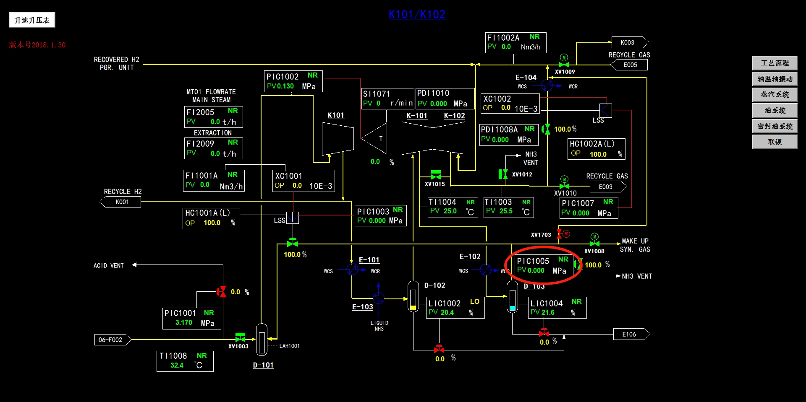

#### 在现场

1. 将**密封油调节阀 `LV1061` 和 `LV1062` 的前后手阀关闭**
   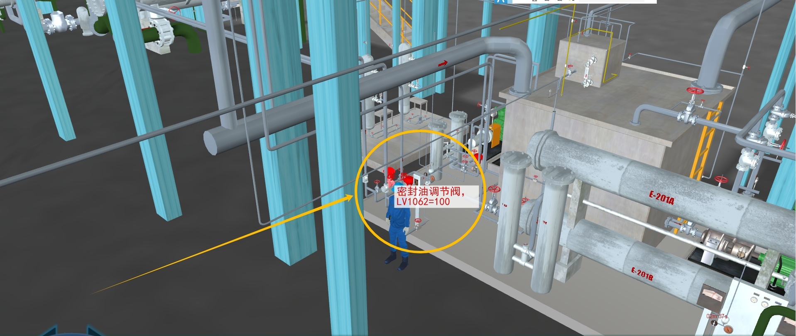
2. 将**压缩机密封油齿轮泵 P202A/B 的`联锁开关`置"M"位**
   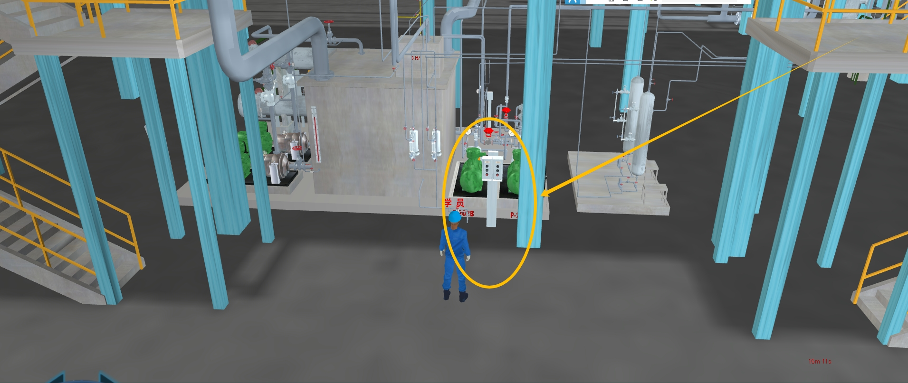
3. **打开`真空冷凝器补水阀 VX5E203` 为 E203 及时补液**
   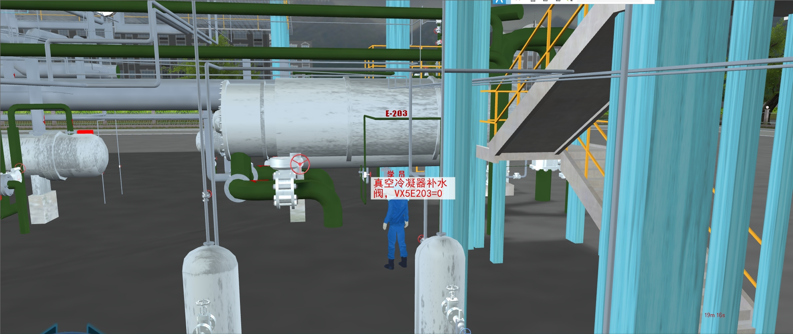
4. **关闭`一抽抽气阀 VI2L0001A`、`一抽入口蒸汽截断阀 VI1L0001A`、`二抽抽气阀 VI2L0002A`、`二抽入口蒸汽截断阀 VI1L0002A`**
   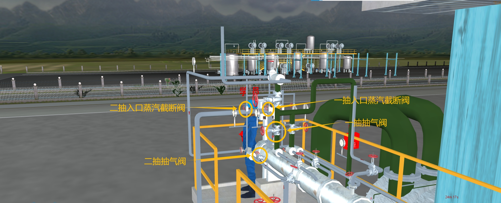
5. **关闭`汽封抽气器入口蒸汽截止阀 VT1118`**
   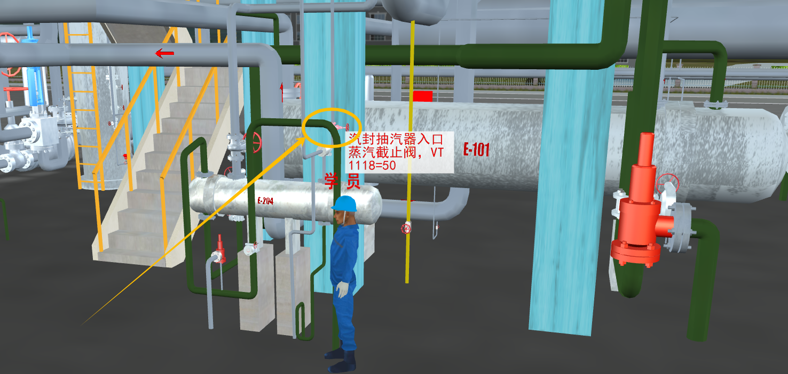
6. **打开`蒸汽导淋阀 VX2HSNY`(位于 E-101 后面)**
   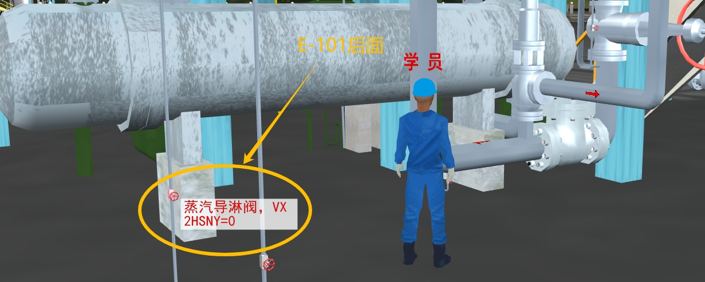
7. **关闭`抽气蒸汽切断阀 VX1MS` 及其`旁路阀 VX2MS`(这里的旁路阀已经处于关闭状态)**
   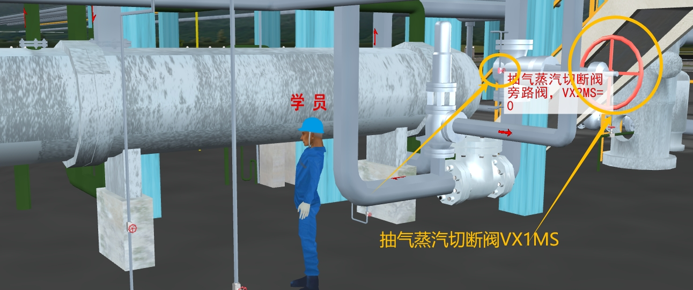
8. **关闭`压缩机 K101 入口切断阀 VI1D101` 及其`旁路阀 VI2D101`(这里的旁路阀已经处于关闭状态)**
   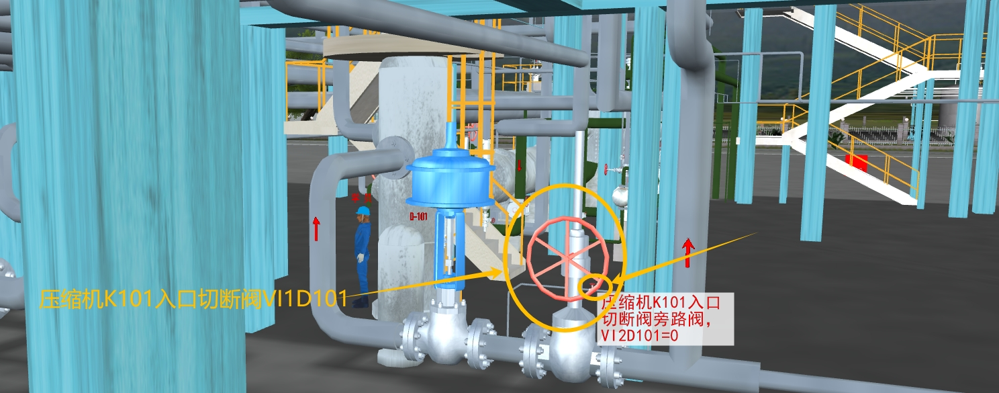
9. **关闭`低压蒸汽阀 VT1109`**
   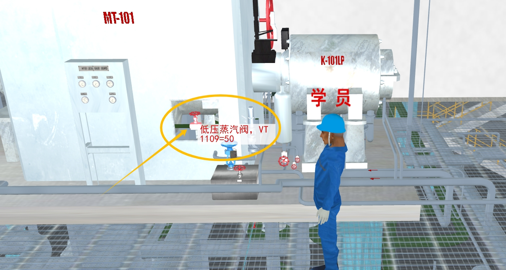
10. **关闭`主蒸汽入口切断阀 VX1HS`及`旁路阀VX2HS`(这里的旁路阀已经处于关闭状态)**
    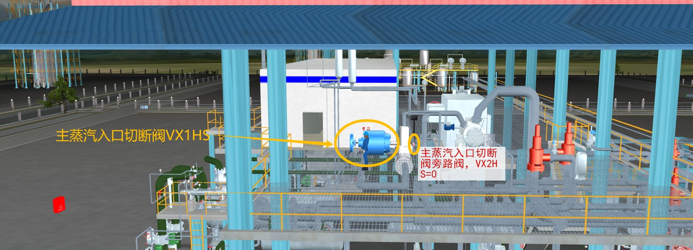

### 真空系统液位高

#### 在现场

> 操作设备位置
> 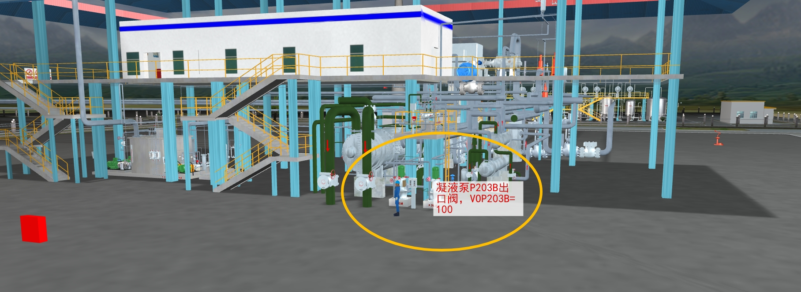

1. 关闭凝液泵备用泵 P203B 的出口阀
2. 将备用泵 P203B 打手动控制
3. 启动备用泵 P203B
4. 打开备用泵 P203B 出口阀
5. 关闭常用泵 P203A 的出口阀
6. 停止常用泵 P203A 的运行

### 油冷器出口油温高

#### 在现场

> 操作设备位置
> 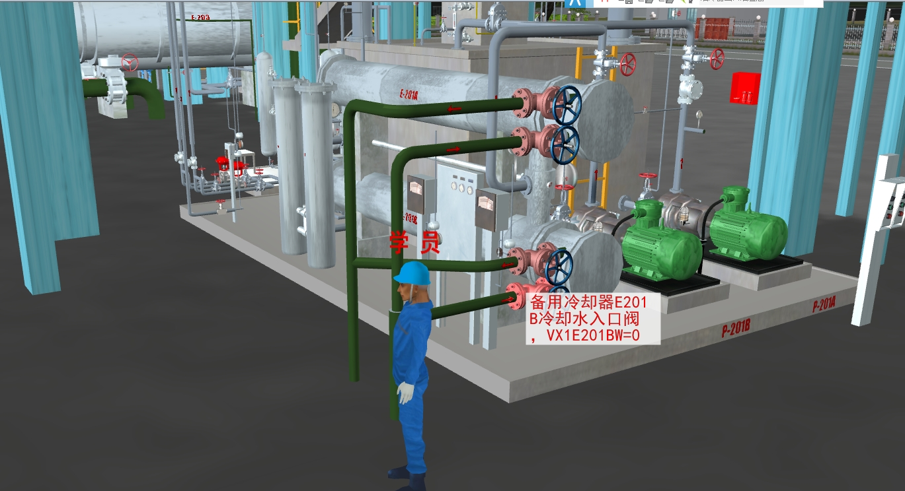

1. 打开备用油冷器 E201B 的冷却水入口阀 VX1E201BW
2. 打开备用油冷器 E201B 的冷却水出口阀 VX2E201BW
3. 切换油冷器
4. 关闭常用油冷器 E201A 的冷却水入口阀 VX1E201AW
5. 关闭常用油冷器 E201A 的冷却水出口阀 VX2E201AW

### 冷却水压力低

#### 在 DCS`K101/K102`画面中

1. 将**压缩机 K101 二段出口压力控制阀 PIC1005** 的 OP 设置为 100%，目的是为缸体泄压
   
2. 关闭压缩机 K101 入口控制阀 XV1003(中控室工具柜左侧或者直接在 DCS 画面中关闭)
   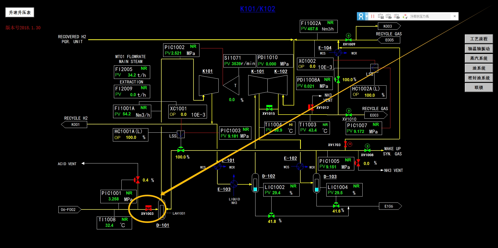
   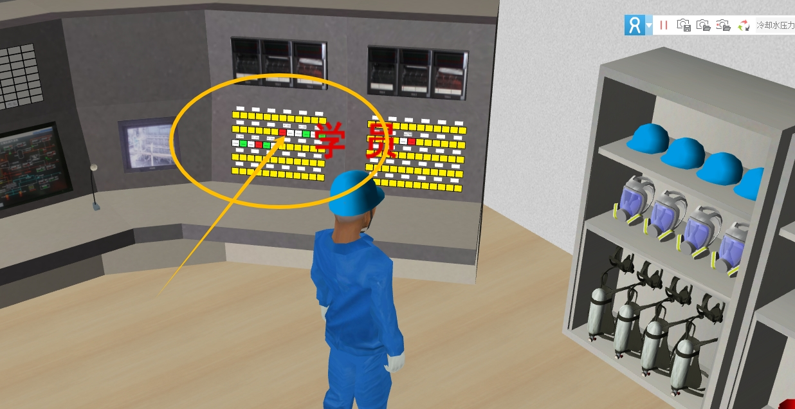

#### 在现场

1. 将**密封油调节阀 `LV1061` 和 `LV1062` 的前后手阀关闭**
   
2. 将**压缩机密封油齿轮泵 P202A/B 的`联锁开关`置"M"位**
   
3. **关闭`汽封抽气器入口蒸汽截止阀 VT1118`**
   
4. **打开`蒸汽导淋阀 VX2HSNY`(位于 E-101 后面)**
   
5. **关闭`抽气蒸汽切断阀 VX1MS` 及其`旁路阀 VX2MS`(这里的旁路阀已经处于关闭状态)**
   
6. **关闭`压缩机 K101 入口切断阀 VI1D101` 及其`旁路阀 VI2D101`(这里的旁路阀已经处于关闭状态)**
   
7. 启动盘车(二层室内墙上左边红色按钮)
   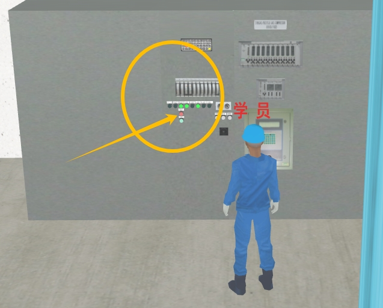
8. **关闭`低压蒸汽阀 VT1109`**
   
9. **关闭`主蒸汽入口切断阀 VX1HS`及`旁路阀VX2HS`(这里的旁路阀已经处于关闭状态)**
   

## 科目四-作业现场应急处置
